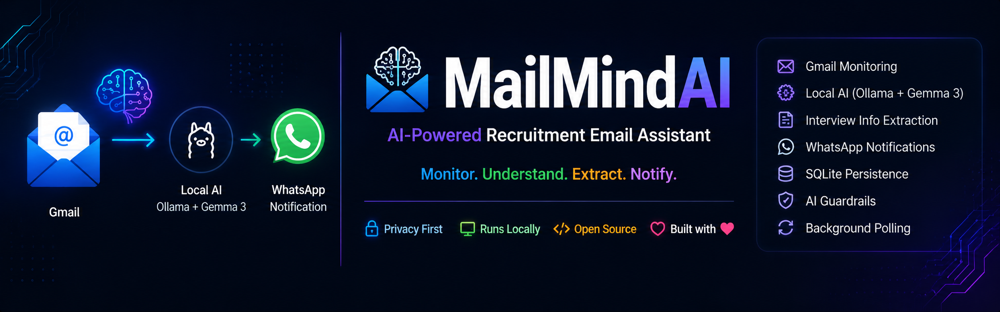

<p align="center">
  
</p>

# MailMindAI 🤖

> Never miss an interview invitation again. MailMindAI continuously monitors Gmail, detects recruitment emails using a local Large Language Model, extracts interview details, and instantly notifies you via WhatsApp while keeping your data private.

MailMindAI is an open-source, privacy-first AI automation project that runs entirely on your own computer using **Ollama** and **Gemma 3**. It demonstrates how local Large Language Models can be combined with traditional software engineering to build practical AI-powered workflows.

> **Current Release:** v0.1.0

---

# Why MailMindAI?

MailMindAI demonstrates an end-to-end AI automation workflow.

It continuously monitors Gmail, identifies genuine recruitment emails, extracts interview information, stores processing history, and instantly sends WhatsApp notifications.

The entire pipeline runs locally, ensuring your emails never need to be processed by cloud AI providers.

---

# Features

- 📧 Continuous Gmail monitoring
- 🧠 Local AI email classification (Ollama + Gemma 3)
- 🛡 AI guardrails for safer AI outputs
- 📅 Interview detail extraction
- 💬 WhatsApp notifications via Twilio
- 🗄 SQLite database for processed email tracking
- 🔄 Background polling service
- ⚙ Modular service-based architecture
- 🔒 Privacy-first local processing

---

# Architecture

```
                    Gmail API
                        │
                        ▼
                 GmailService
                        │
                        ▼
                  AIService
             (Ollama + Gemma 3)
                        │
                        ▼
              GuardrailService
                        │
          ┌─────────────┴─────────────┐
          ▼                           ▼
 DatabaseService             NotificationService
    (SQLite)                         │
                                     ▼
                              TwilioService
                                     │
                                     ▼
                                WhatsApp
```

<p align="center">
  
</p>

---

# Workflow

```
New Gmail Email
        │
        ▼
Polling Service
        │
        ▼
AI Classification
        │
        ▼
Guardrail Validation
        │
        ▼
Save Processing State
        │
        ▼
WhatsApp Notification
```

---

# Tech Stack

- Python
- Gmail API
- Ollama
- Gemma 3
- SQLite
- Twilio WhatsApp API
- Git
- GitHub

---

# Project Structure

```
src/
│
├── models/
│   └── email.py
│
├── services/
│   ├── ai_service.py
│   ├── database_service.py
│   ├── gmail_service.py
│   ├── guardrail_service.py
│   ├── notification_service.py
│   ├── pipeline_service.py
│   ├── polling_service.py
│   └── twilio_service.py
│
└── main.py
```

---

# Current Release (v0.1.0)

This release includes:

- ✅ Continuous Gmail monitoring
- ✅ Local AI email classification
- ✅ AI guardrails
- ✅ Interview information extraction
- ✅ SQLite persistence
- ✅ Duplicate email prevention
- ✅ WhatsApp notifications
- ✅ Background polling

---

# Contributing

Contributions, bug reports, and suggestions are always welcome.

If you'd like to contribute:

- Open an Issue
- Submit a Pull Request
- Start a discussion

---

# License

This project is licensed under the **GNU Affero General Public License v3.0 (AGPL-3.0)**.

See the `LICENSE` file for details.

---

# Project Status

MailMindAI is under active development.

The goal is to explore practical AI automation using local Large Language Models while maintaining a clean, modular, and privacy-first architecture.

---

# Support

If you found this project useful or interesting:

- ⭐ Star the repository
- 🐛 Report bugs
- 💡 Suggest improvements
- 📢 Share it with others

Your support helps improve the project and encourages further open-source development.

---

Built with ❤️ using Python, Ollama and Local AI.