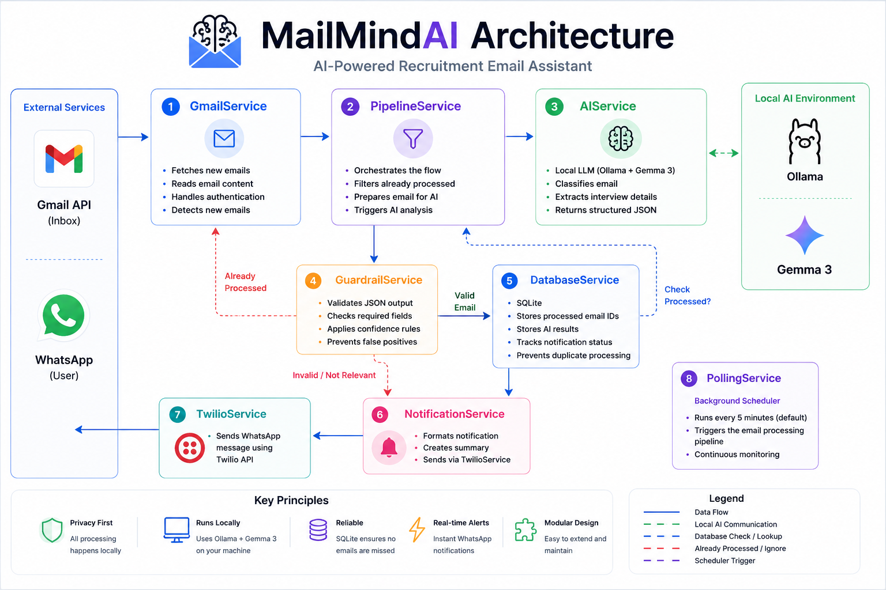

# MailMindAI Architecture

## Overview

MailMindAI is a privacy-first AI agent that continuously monitors Gmail for recruitment-related emails, analyses them using a local Large Language Model (LLM), validates the AI response, stores processing history, and sends real-time WhatsApp notifications.

All AI processing is performed locally using Ollama and Gemma 3, ensuring that email contents are never sent to external AI providers.

---

## System Architecture

<p align="center">
    
</p>

---

## Processing Pipeline

```
Polling Service
        │
        ▼
Pipeline Service
        │
        ▼
Gmail Service
        │
        ▼
Unread Emails
        │
        ▼
Already Processed?
      │        │
     Yes       No
      │        ▼
   Ignore   AI Service
                │
                ▼
        Ollama + Gemma 3
                │
                ▼
       Structured JSON Result
                │
                ▼
        Guardrail Service
          │           │
      Invalid      Valid
          │           ▼
      Save State  Notification Service
                      │
                      ▼
                 Twilio Service
                      │
                      ▼
                 WhatsApp User
```

---

# Components

## PollingService

Responsible for running MailMindAI continuously.

Responsibilities:

- Runs every configured interval
- Starts the processing pipeline
- Handles graceful shutdown

---

## PipelineService

Coordinates the complete email processing workflow.

Responsibilities:

- Retrieve unread emails
- Skip previously processed emails
- Call the AI service
- Validate AI output
- Persist results
- Trigger notifications

---

## GmailService

Handles all Gmail API communication.

Responsibilities:

- OAuth authentication
- Search unread emails
- Retrieve email content

---

## AIService

Communicates with the local Ollama model.

Responsibilities:

- Build prompts
- Send prompts to Gemma 3
- Parse JSON response
- Handle AI errors

---

## GuardrailService

Validates AI output before further processing.

Responsibilities:

- Verify required fields
- Check confidence
- Prevent false positives
- Reject malformed responses

---

## DatabaseService

Stores processing history.

Responsibilities:

- Store processed message IDs
- Prevent duplicate processing
- Persist AI extraction results

Database:

- SQLite

---

## NotificationService

Creates user-friendly notifications.

Current notification channels:

- WhatsApp

Future channels:

- Email
- Telegram
- Slack
- Microsoft Teams
- Discord

---

## TwilioService

Responsible for communicating with the Twilio WhatsApp API.

Responsibilities:

- Format API requests
- Send WhatsApp messages
- Return delivery status

---

# Design Principles

MailMindAI follows several software engineering principles.

- Single Responsibility Principle
- Separation of Concerns
- Modular Architecture
- Local-First AI
- Privacy by Design
- Extensible Service Layer
- Persistent State Management

---

# Current Workflow

```
Gmail

↓

Unread Email

↓

Pipeline

↓

Gemma 3

↓

Guardrails

↓

SQLite

↓

WhatsApp Notification
```

---

# Future Architecture

The current MailMindAI project is the foundation of a larger open-source platform named **Career Assistant AI**.

Future modules include:

- Job Search Engine
- Resume Parser
- AI Job Matching
- Google Calendar Integration
- Interview Preparation
- Application Tracking
- RAG Knowledge Base
- Dashboard
- Multi-LLM Support
- Plugin Architecture

These modules will extend the existing service-based architecture without requiring major changes to the core pipeline.